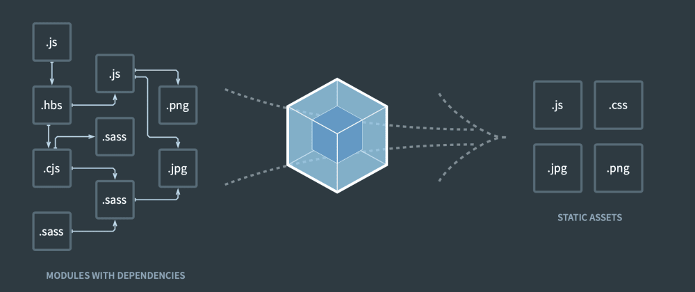

## 1. Webpack 介绍
### 1-1. 什么是 Webpack

文档: https://webpack.docschina.org/

Webpack 是一个模块打包器 (bundler)，本质就是一个工具包。 

在 Webpack 看来，项目源码中所有的静态资源文件都是模块，如 JS / JSON / CSS / LESS / IMG / FONTS 等等，这些文件都会作为模块来处理。

Webpack 会根据模块之间的依赖关系，进行分析打包所有在整个依赖图中的模块资源，生成最终的浏览器能高效运行的静态资源。




### 1-2. 五个核心概念
Webpack 有五个核心的概念需要知道，分别是

- Entry 		入口
- Output		出口/输出
- Loader		加载器
- Plugin		插件
- Mode		    模式
#### Entry 入口
入口起点(entry point) 指示 webpack 应该使用哪个模块，来作为构建其内部依赖图的开始。进入入口起点后，webpack 会找出有哪些模块和库是入口起点依赖的
​

#### Output 出口
Output 属性告诉 webpack 在哪里生成(输出)打包文件(bundles)，以及如何命名打包文件


#### Loader 加载器
Webpack 默认只能处理 JS / JSON 文件，如果需要打包其他类型文件，就需要使用对应的 loader 进行处理。例如 css-loader，less-loader，babel-loader 等等

Loader 本质是 JS 函数，接受源文件内容，返回转换后的结果内容
​

#### Plugin 插件
loader 用于转换某些类型的模块，而插件则可以用于执行范围更广的其它任务。包括：压缩文件，代码规范检查等


#### Mode 模式
Webpack 主要有两种工作模式，分别是 development 开发模式和 production 生产模式, 不同模式提供了不同的默认配置。


## 2. 安装 Webpack
- 全局安装（这一步暂时不需要做）

```bash
npm install webpack webpack-cli -g
```
- 局部安装（选他，选他，选他）

```bash
npm init -y
npm install webpack webpack-cli -D   # cli  Command Line Interface 命令行接口
```
> `官方推荐使用『局部安装』`，这样可以避免因为版本不同而产生的 BUG


## 3. Webpack 初体验

1. 创建JS模块: `src/js/m1.js`
   
   ```js
   export const sum = (x, y) => {
     return x + y
   }
   ```
   
2. 创建JSON模块: `src/json/movie.json`

   ```js
   [
     {
       "id": 1,
       "name": "让子弹飞",
       "director": "姜文"
     }
   ]
   ```

3. 创建入口JS模块: `src/main.js`

   ```js
   import {sum} from './js/m1' // 引入js模块
   import movies from './json/movie.json' // 引入json模块
   
   console.log(sum(2, 3))
   console.log(movies)
   
   document.write('Hello Webpack!')
   ```

4. 创建HTML页面: `public/index.html`

   ```html
   <!DOCTYPE html>
   <html lang="en">
   <head>
     <meta charset="UTF-8">
     <meta name="viewport" content="width=device-width, initial-scale=1.0">
     <title>Document</title>
   </head>
   <body>
     	
   </body>
   </html>
   ```

5. 安装

   ```sh
   npm init -y
   npm i webpack webpack-cli -D
   ```

6. 执行打包命令  『项目根目录下运行』 
    ```bash
    # 开发模式打包
    npx webpack --entry ./src/main.js  --output-path ./build/js --output-filename bundle.js --mode development
    
    # 生产模式打包
    npx webpack --entry ./src/main.js  --output-path ./build/js --output-filename bundle2.js --mode production
    ```

      - --entry  							 设置入口
      - --output-path               设置输出目录
      - --output-filename 		设置输出文件名
      - --mode 				           设置运行模式

    > 区别 npm 与 npx ?
    >
    > - 它们都是由`Node`提供的2个工具, 用来做工具包的相关处理
    > - `npm` (Node Package Manager) : 包管理器,  用来`下载工具包`
    > - `npx` (Node Package Excuted) : 包扩展工具, 用来`运行工具包命令`
    > - npx 查找工具包的顺序: `局部查找 ==> 全局查找 ==> 运行`

7. HTML 文件引入打包文件

   ```html
   <script src="../build/js/bundle.js"></script>
   ```

8. 打开页面测试效果

   

> 初体验需要改进的地方：
> 1. 打包命令太复杂
> 2. ES6 没有转为 ES5
> 4. 修改后必须手动重新打包, 不能自动重新打包
> 4. 只能打包 JS 和 JSON， 不能打包其他类型的文件

## 4. 使用配置文件打包

> `问题`：打包命令太复杂(需要指定打包的各种配置信息)
>
> `解决`：通过JS类型的配置文件来指定打包的配置信息

`项目根目录`下创建文件 `webpack.config.js`，内容如下：

```javascript
const {resolve} = require('path'); // path模块是Node内置的
// __dirname：当前配置文件所在的目录绝对路径
// resolve: 用来拼接路径的函数

// 暴露配置对象
module.exports = {
    // 入口
    entry: './src/main.js',
  
    // 出口
    output: {
        path: resolve(__dirname, 'build'), // 打包文件所在的根目录
        filename: 'js/bundle.js', // 打包生成的js文件名(可以带目录)
        clean: true, // 打包时, 会先自动清空打包文件夹
    },
   
    // 模式
  	// mode: 'production',
    mode: 'development',
}
```


创建完毕之后，在项目根目录执行如下命令：
```bash
npx webpack
```

## 5. 打包样式

### 5-1. 打包 css 文件

> `问题`：webpack本身只能打包 JS 文件和 JSON 文件, 不能打包CSS文件 
>
> `解决`：利用`css-loader & style-loader` 对CSS进行打包处理

1. 首先先创建 HTML 结构与对应的 CSS 文件样式

   public/index.html

   ```html
   <header></header>
   ```

   src/css/app.css

   ```css
   header {
     height: 100px;
     background: rgb(95, 51, 93);
     display: flex;
   }
   ```

1. 在入口 JS 文件中 引入 CSS 文件
```javascript
import './css/app.css' // 引入css模块	
```

3. 安装 loader
```bash
npm i style-loader css-loader -D
```

4. 修改 webpack.config.js 配置文件
```js
module.exports = {
    mode: 'development',
    
    // 配置 loader
    module: {
        rules: [
          	// 配置 css 文件处理
            {
                test: /\.css$/, // 处理css文件
                use: [
                    "style-loader",		// 将 CSS 生成 style 标签插入 HTML 中
                    "css-loader"  		// 将 CSS 转为 CommonJS 的模块
                ]
            }   
        ]
    },
}
```

5. 运行打包命令  『在项目的根目录下运行』
```bash
npx webpack
```
### 5-2. 打包 less 文件

> `问题`：在前台项目开发时, 很可能会使用CSS预编译器(less/sass/stylus)来快速编写页面样式, webpack不能处理
>
> `解决`：利用`less & less-loader` 来对less样式进行打包处理

1. 首先编写 HTML 结构以及 LESS 文件样式

   public/index.html

   ```html
   <section class="content">
   </section>
   ```
   
   src/less/app.less
   
   ```
   @bg: rgb(162, 135, 157);
   
   .content {
     height: 800px;
     background: @bg;
   }
   ```
   
   
   
1. JS 文件导入 LESS 文件

   ```js
   import "./less/app.less"
   ```

1. 安装 loader

   ```shell
   npm i less less-loader -D
   ```

1. 配置 loader

```js
module.exports = {
    module: {
        rules: [
            .
            .
            .
  		   // 配置 less 文件处理
            {
                test: /\.less$/, // 处理less文件
                use: [
                    'style-loader', // 将 CSS 生成 style 标签插入 HTML 中
                    'css-loader', // 将 CSS 转为 CommonJS 的模块
                    'less-loader' // 将Less编译为CSS
                ]
            },
        ]
    }
}	
```

5. 执行打包命令
```bash
npx webpack
```
## 6. 打包 JS

### 6-1. JS 语法转换

> `问题`：一些浏览器(尤其是IE)对ES6新语法的支持不够(不兼容), 但前端开发基本都在用ES6+的语法
>
> `解决`：利用`babel`相关工具包将 ES6 转换为 ES5

Babel 可以将浏览器不能识别的新语法（ES6-11）转换成原来识别的老语法（ES5），浏览器JS兼容性处理。 操作流程：


1. 安装babel相关工具包

   ```shell
   npm install -D babel-loader @babel/core @babel/preset-env
   ```

   - @babel/core  		babel 的核心库 (本身并不能完成 ES6 转 ES5)
   - @babel/preset-env	babel 的预设工具包，将 ES6 新语法转为 ES5
   - babel-loader   		babel 在 webpack 中的 loader 包

   > `babel 插件包`: 每个 ES6 的新语法都有一个对应的 babel 插件包来转换为对应的 ES5 语法 
   >
   > `babel 预设包`: 包含多个常用的 babel 插件包的一个大的集合包 ==> 简化配置


2. 配置 loader
```javascript
module.exports = {
    module: {
        rules: [
  		    //配置 babel 的 loader
            {
                test: /\.js$/,
                exclude: /node_modules/, // 不进行处理的文件夹
                use: {
                    loader: 'babel-loader',
                    options: {
                        presets: ['@babel/preset-env'], // 指定bebel预设包
      				   plugins: [], // 指定babel插件包
                    }
                }
            },
          
        ]
    }
}
```

3. 设置目标浏览器

   > `问题`：webpack5 打包生成的 JS 代码默认是被包裹在『箭头函数』中， 而IE不支持箭头函数
   >
   > `解决`：在 `package.json` 配置说明兼容 IE 浏览器  => 打包文件中的箭头函数变为 function 函数

   ```json
   "browserslist": [
     "> 0.1%",
     "not ie <=8"
   ]
   ```

4. 执行打包命令
```bash
npx webpack
```
### 6-2. JS 兼容性处理

> - 区别ES6的 `新语法` 与 `新API`
>   -  `新语法`: 可以转换为ES5的对应语法, 如: const / let / 箭头函数 / 解构等
>   - `新API`: 没有对应的ES5语法可转换, 如 Promise / Array的新方法 / Map / Set
> - `@babel/polyfill` 包
>   - 提供了 ES6 所有新API的实现代码
>   - 准确的说是由其依赖的`core-js`包提供的实现

> `问题`：babel的预设包/插件包并不能处理 ES6 的新 API  ==> IE不支持ES6新API, 会报错
>
> `解决`：利用`polyfill`包提供 ES6 新 API的实现 ==> 不支持ES6新API的浏览器也可以兼容了 

#### Polyfill 

1. 安装 polyfill

   ```shell
   npm i @babel/polyfill -S
   ```

2. 入口文件引入 polyfill

   ```js
   import '@babel/polyfill';
   ```

3. 重新打包   

   ```
   npx webpack
   ```

#### core-js

> `问题`： 完整引入 polyfill 包会导致打包文件过大
>
> `解决`： 配置按需打包， 减小打包文件大小  =>  `useBuiltIns: 'usage'`

1. 修改 babel-loader 的配置

   ```js
   {
       test: /\.js$/,
           exclude: /node_modules/, 
               use: {
               loader: 'babel-loader',
                   options: {
                       //修改 presets 为下面的内容
                       presets: [
                           [
                               '@babel/preset-env',
                               {
                                   useBuiltIns: 'usage', // 只打包使用的ES6新API的实现代码
                                   corejs: { version: 2 } // 指定core-js的版本号为2
                               }
                           ]
                       ], 
                   }
               }
   },
   ```

2. 移除入口文件中的 『import  '@babel/polyfill'』

3. 执行打包命令

   ```
   npx webpack
   ```

### 6-3. JS 代码规范检查

> `问题`：如何保证项目小组多个程序员的JS代码规范且风格一致呢 
>
> `解决`：利用`eslint`工具对代码进行统一的代码规范检查

ESLinst 文档：https://eslint.bootcss.com

> ESLint能对 JS 语法规范进行检查
>
> ESlint 不能检查 JS 运行时错误，因为并没有执行 JS 代码


1. 安装插件

   ```shell
   npm i eslint eslint-webpack-plugin -D
   ```

2. 修改 webpack.config.js 配置文件

   ```js
   // 导入ESLint插件
   const ESLintPlugin = require('eslint-webpack-plugin');
   
   module.exports = {
       mode: 'development',
       module: {
           .
           .
           .
       },
       
     	// 配置进行ESlint检查的插件
     	plugins: [
           new ESLintPlugin()
       ]
     
   }
   ```

   

3. 项目根目录下创建 eslint 配置文件 『.eslintrc.js』

   ```js
   module.exports = {
     extends: "eslint:recommended", // 使用eslint推荐的默认规则
     rules: {
       // eslint检查的规则  0 忽略 1 警告 2 错误
       "no-console": 0, // 不检查console
       eqeqeq: 1, // 要求使用 === 
       "no-alert": 0, // 不能使用alert
     },
     parserOptions: {
       ecmaVersion: 6, // 支持es6
       sourceType: "module", // 使用es6模块化
     },
     env: {
       // 环境 用来指定识别哪个环境的全局变量
       browser: true, // 支持浏览器中的全局变量
       node: true, // 支持node中的全局变量
       es6: true, // 支持ES6中的全局变量
     },
     globals: {
       // 声明使用的全局变量, 这样即使没有定义也不会报错了
       axios: "readonly", // $ 不允许重写变量
     },
   };
   ```

4. 执行打包命令

   ```
   npx webpack
   ```

## 7. 打包 HTML 

> `问题`： 在HTML中手动引入打包文件比较麻烦，且没有压缩处理
>
> `解决`： 使用`html-webpack-plugin`打包HTML => 自动引入打包文件，压缩HTML


1. 删除HTML中引入的JS打包文件

2. 安装插件

   ```sh
   npm i html-webpack-plugin -D
   ```

3. 修改 webpack.config.js 配置文件

   ```js
   // 1. 引入插件
   const HtmlWebpackPlugin = require('html-webpack-plugin');
   
   module.exports = {
       plugins: [
         
         
          	// 2. 配置打包HTML的插件
           new HtmlWebpackPlugin({
               template: "./public/index.html",// 指定html模板文件。
               inject: "body",// 将打包生成的JS文件放置在body尾部
               hash: true,// 在引入JS时增加hash后缀字符串,去除缓存。
               minify: {
                   removeAttributeQuotes: true,// 移除属性中的双引号
                   removeComments: true,// 移除注释
                   collapseWhitespace: true,// 去除空格与换行
               }
           })
         
       ]
   }
   ```

4. 执行打包命令

   ```shell
   npx webpack  # 打包产生的页面自动引入js打包文件
   ```

## 8. 打包图片

### 8-1. 打包 CSS和JS 中的图片

> `问题`： 在CSS或JS中我们都有可能引入图片, 如何打包这些图片文件呢?
>
> `解决`： 我们可以用内置的资源加载器来处理
>
> 
>
> 参考文档：https://webpack.docschina.org/guides/asset-modules/


1. 在CSS中引入图片

   ```html
   <div class="react"></div>
   <div class="vue"></div>
   ```

   拷贝图片`react.png` `vue.png`到src/img文件夹下

   ```less
   .react {
     width: 200px;
     height: 200px;
     float: left;
     margin-right: 20px;
     background: url('../images/react.png');
     background-size: cover;
   }
   .vue {
     width: 200px;
     height: 200px;
     float: left;
     background: url('../images/vue.png');
     background-size: cover;
   }
   ```

   

1. 修改 webpack.config.js

   ```js
   module.exports = {
       mode: 'development',
       module: {
           rules: [
          
           	// 处理图片
             {
                 test: /\.(jpg|png|gif)$/,
                 type: "asset",
                 // 解析器
                 parser: {
                   // 指定进行图片base64编码最大文件大小
                   dataUrlCondition: {
                     maxSize: 5 * 1024, // 5kb    默认8k
                   }
                 },
                 // 打包生成的文件
                 generator: {
                   filename: 'images/[hash:8][ext]',
                 },
              },
             
           ]
       }
   }
   ```

1. 重新打包

   ```
   npx webpack
   ```

> 图片base64编码：对要引入的小图片转换为特定字符串，显示时还是为原图片
>
> 好处：减少HTTP请求，加快图片显示
>
> 限制：只合适小图片，如果是大图也做base64处理，会导致css/html文件过大，不利用页面显示

### 8-2. 打包 HTML 中的图片

> `问题`：内置的资源打包器不能打包处理html中  引入的图片
>
> `解决`：利用`html-loader`打包html中引入的图片

1. HTML 结构中引入图片

   拷贝图片 `angular.png`到`public/img`目录下

   ```html
   
   ```

1. 安装 loader

   ```shell
   npm i html-loader -D
   ```

1. 配置 loader

   ```js
   module.exports = {
       module: {
           rules: [
   
   		 // 配置 html 的 loader
               {
                   test: /\.(html)$/,
                   use: {
                       loader: 'html-loader'
                   }
               }
             
           ]
       }
   }
   ```

1. 执行打包

   ```
   npx webpack
   ```

> 需要移除 public/index.html 中的 script 标签, 否则会再次导入 JS, 造成打包失败

### 8-3. 打包字体图标

> `问题`：项目中有可能引入字体图片文件来显示小图标, 如何打包字体图标呢?
>
> `解决`：我们也可以用内置的资源加载器来处理

首先先下载一个阿里图标库中的项目，然后按照如下流程操作：

1. 将字体文件复制到 `src/fonts` 目录下

   iconfont.ttf / iconfont.woff / iconfont.woff2

1. 复制 CSS 代码到样式文件中，这里可以是 CSS 文件，也可以是 LESS 文件

   ```css
   @font-face {
     font-family: 'iconfont';
     src: url('../fonts/iconfont.woff2?t=1652078424644') format('woff2'),
           url('../fonts/iconfont.woff?t=1652078424644') format('woff'),
           url('../fonts/iconfont.ttf?t=1652078424644') format('truetype');
   }
   
   .iconfont {
     font-family: "iconfont" !important;
     font-size: 16px;
     font-style: normal;
     -webkit-font-smoothing: antialiased;
     -moz-osx-font-smoothing: grayscale;
   }
   ```

1. HTML 结构中创建对应的 span 标签   

   ```html
   <span class="iconfont">&#xe745;</span>
   ```

1. 修改 webpack.config.js 配置文件

   ```js
   module.exports = {
       mode: 'development',
       module: {
           rules: [
   
     			// 打包字体图标
               {
                 test: /\.(eot|svg|woff|woff2|ttf)$/,  
                 type: 'asset',
                 // 解析器
                 parser: {
                   // 指定进行base64编码最大文件大小
                   dataUrlCondition: {
                     maxSize: 5 * 1024, // 5kb
                   }
                 },
                 generator: {
                   filename: 'fonts/[hash:8][ext]',
                 },
               },
             
           ]
       },
   }
   ```

1. 重新打包

   ```
   npx webpack
   ```

## 9. 自动打包运行
> `问题`：修改任何代码，都要重新打包 ==》 麻烦
>
> `解决`：利用`webpack-dev-server`(webpack开发服务器)来修改后重新自动打包运行

1. 安装 webpack-dev-server

   ```shell
   npm i webpack-dev-server -D
   ```

2. 修改 webpack.config.js 配置

   ```js
   module.exports = {
   
       output: {
           path: resolve(__dirname, 'build'),
           filename: 'js/bundle.js',
           clean: true,
         
           // 设置引入打包文件的基础路径，默认是相对路径
           publicPath: '/'
         
       },
       module: {},
       plugins: [],
   
       // 配置开发服务
       devServer:{
           port:3000,// 设置端口号
           open:true,// 自动在浏览器中打开页面
       }
     
   }
   ```

3. 运行启动命令

   ```shell
   npx webpack-dev-server # 会自动启动浏览查看效果, 修改代码后会自动刷新
   ```

## 10. 开启sourceMap调试
>`问题`：代码运行报错， 不能定位到哪个源文件哪行有问题 ，不方便调试
>
>`解决`：利用`devtool`配置生成sourceMap，出错提示哪个源文件哪一行的问题

> `sourceMap文件`: 
>
> ​		记录打包文件与源码文件的映射关系文件,  打包文件中一条语句对应的是哪个文件哪一行

1. 编写一个错误的代码: src/js/m1.js

   ```js
   export const sum = (x, y) => {
     console.log2('sum')
     return x + y
   }
   ```

   > 此时的错误提示不太友好, 没有指出是m1.js中第2行出错了

2. 修改webpack配置

   ```js
   module.exports = {
       plugins: [],
       devServer:{},
   
       // 开启sourceMap调试
     	// devtool: 'source-map', // 生成单独的sourceMap文件 ==> 慢
   	devtool: 'cheap-module-source-map', // 只生成内联的sourceMap ==> 快
     	// 生产环境打包不用生成sourceMap， 只有开发环境需要
     
   }
   ```

3. 重新开发服务器运行

   ```sh
   npx webpack-dev-server
   npx webpack
	```
   > 此时的错误信息输出就是: m1.js中第2行出错了

## 11. 拆分webpack配置
> `问题`：开发环境与生产环境对webpack打包的要求不太一样， 一个配置文件不好搞定
>
> `解决`：针对开发环境与生产环境，编写不同的webpack配置文件


1. 根目录下创建文件夹 config，将 webpack.config.js 复制两份
   - ./config/webpack.dev.js
   - ./config/webpack.prod.js
   
2. 修改 webpack.prod.js

   ```js
   module.exports = {
   
       // 1. 设置模式为生产模式
       mode: 'production',
     	output: {
         // 4. 修改打包输出的根目录
         path: resolve(__dirname, '../build')
       },
     	// 2. 删除 devServer 设置
     	// 3. 删除 devtool 设置
   }
	```

3. 修改 package.json，配置打包运行的npm命令

   ```shell
   "scripts": {
   		"start": "webpack-dev-server --config ./config/webpack.dev.js",
   		"build": "webpack --config ./config/webpack.prod.js"
   }
	```

4. 运行命令

   ```shell
   开发环境运行：npm run start
   
   生产环境打包：npm run build
   全局安装小服务器：npm i -g serve
   运行项目：serve build
	```

   

## 12. CSS 进一步处理

### 12-1. CSS单独打包

> `问题`：默认情况下CSS代码是被打包到JS文件中的， 不利于后面的生产环境打包的优化处理
>
> `解决`：利用 `mini-css-extract-plugin`将CSS从JS中抽取出来，单独打包


1. 安装工具包

   ```shell
   npm i mini-css-extract-plugin -D
	```

2. 修改 webpack.prod.js

   ```js
   // 1. 引入插件
   const MiniCssExtractPlugin = require("mini-css-extract-plugin");
   
   module.exports = {
       
       module: {
           rules: [
             
           	// 2. 修改loader，将之前的style-loader换为MiniCssExtractPlugin.loader
               {
                   test: /\.css$/,
                   use: [
                       MiniCssExtractPlugin.loader,
                     	// "style-loader" // 运行时将js中css添加到页面的<style>
                       "css-loader",
                   ]
               },
               {
                   test: /\.less$/,
                   use: [
                       MiniCssExtractPlugin.loader,
                     	// "style-loader"
                       'css-loader',
                       'less-loader'
                   ]
               },
             
           ]
       },
       plugins: [
         
           // 3. 配置插件
           new MiniCssExtractPlugin({					
               filename: "css/[hash:8].css",
           }),
           
       ]
   }
	```

3. 重新生产打包并运行

   ```shell
   npm run build # 在build/css目录下单独生成了css文件
   ```
   


### 12-2. CSS 兼容性处理

> `C3样式厂商前缀`: 为了让我们使用的C3样式有更好的浏览器兼容性, 我们需要指定不同的厂商前缀
>
> - -moz- 代表firefox浏览器私有属性
> - -ms- 代表ie浏览器私有属性
> - -webkit- 代表safari、chrome私有属性
> - -o- 代表Opera

> `问题`:  打包CSS时, 默认没有给C3样式添加厂商前缀 
>
> `解决`:  利用 `postcss `和 `autoprefixer`在打包css时自动添加C3样式厂商前缀, 兼容不同浏览器


1. 安装相关工具包

   ```shell
   npm i postcss-loader autoprefixer -D
   ```

2. 修改 webpack.prod.js 中的 css 和 less 的 loader 设置

   ```js
   module.exports = {
       module: {
           rules: [
             
           	// 配置 postcss-loader
               {
                   test: /\.css$/,
                   use: [
                       MiniCssExtractPlugin.loader,
                       "css-loader",
                       'postcss-loader', // 添加在css-loader下面
                   ]
               },
               {
                   test: /\.less$/,
                   use: [
                       MiniCssExtractPlugin.loader,
                       'css-loader',
                       'postcss-loader', // 添加在css-loader下面
                       'less-loader'
                   ]
               },
   
           ]
       },
      
   }
   ```

   

3. 项目根目录下创建 postcss.config.js

   ```js
   module.exports = {
       plugins: [ // 在postcss插件中指定autoprefixer
           require('autoprefixer')
       ]
   }
   ```

4. 修改 package.json，增加 `browserslist` 属性

   ```json
   "browserslist": [
     "> 0.1%",
     "not ie <=8"
   ]
   ```

5. 重新打包

   ```shell
   npm run build
   ```

### 12-3. CSS 压缩
> `问题`: 单独打包的CSS默认是没有压缩的, **生产环境下(production)**需要对CSS进行压缩减小打包文件
> `解决`: 使用`css-minimizer-webpack-plugin` 插件压缩 CSS 代码


1. 安装插件

   ```sh
   npm i css-minimizer-webpack-plugin -D
   ```

2. 修改配置文件

   ```js
   // 1. 引入插件
   const CssMinimizerPlugin = require('css-minimizer-webpack-plugin');
   
   module.exports = {
     
       // 2. 在优化配置中指定插件来压缩CSS
       optimization: {
           minimizer: [new CssMinimizerPlugin()],
       },
     
   }
   ```

3. 重新打包

   ```shell
   npm run build
   ```

## 13. JS 进一步处理

### 13-1. JS 压缩

> `问题`: 一旦配置了`optimization`来压缩CSS后, 发现JS打包文件就没有压缩了, JS同样是需要压缩的
> `解决`: 使用webpack5内置插件`terser-webpack-plugin` 压缩 JS 代码

1. 修改配置文件 webpack.prod.js

   ```js
   // 1. 引入插件
   const TerserPlugin = require("terser-webpack-plugin");
   
   module.exports = {
     
       // 2. 在优化配置项中指定插件压缩JS
       optimization: {
           minimizer: [
     					...
               new TerserPlugin()
           ],
       },
   }
   ```
   
2. 重新打包

   ```
   npm run build
   ```

### 13-2. JS文件名hash化

> - 理解『文件名 hash 化』:
>   - 对一个文件内容进行md5加密可以产生一个对应的md5值, md5值随着内容变化而变化
>   - 将文件内容的md5值作为文件名的组成部分, 称之为`文件名hash化`
> - 为什么要做文件名hash化处理?
>   - 浏览器会对请求得到的某个资源文件进行缓存, 如果下次再请求同一个地址的资源时就会使用缓存
>   - 再次打包, 
>     - 打包生成的文件内容不变,那其hash文件名也不变化,对应的url就不会变化, 浏览器就会使用缓存
>     - 如果打包文件内容变化了, 文件名变化了, 对应的url也会变化, 浏览器就不会使用缓存
>   - 这样做了文件名hash化处理后, 可以合理利用浏览器缓存 

> `问题`: 图片和CSS都已经做了文件名hash化处理, 但JS还没有做此处理
> `解决`: 修改配置对JS文件名也做hash化处理

1. 修改配置文件 webpack.prod.js

   ```js
   output: {
   	filename: 'js/bundle-[contenthash:8].js'
       ...
   }
   ```

2. 重新打包

   ```
   npm run build
   ```

## 附录

### browserslist
browserslist 目标浏览器配置表，可以针对目标浏览器进行编译处理，避免不必要的兼容代码

browserslist 配置的方法有两种，一种是修改 『package.json』 配置，一种创建 『.browserslistrc』 文件
​


1. package.json 形式
```shell
{
	.
	.
	.
	"browserslist": [
        ">0.2%",
        "not dead",
        "not op_mini all"
    ]
}
```

2. 项目根目录下创建『.browserslistrc』 文件
```shell
> 1%
last 2 versions
```
配置规则介绍

| **规则** | **介绍** |
| --- | --- |
| > 1% | 全球超过1%人使用的浏览器 |
| > 5% in US | 指定国家使用率覆盖 |
| last 2 versions | 所有浏览器兼容到最后两个版本根据CanIUse.com追踪的版本 |
| Firefox > 20 | 指定浏览器的版本范围 |
| not ie <=8 | 排除 ie8 及以下 |
| Firefox 12.1 | 指定浏览器的兼容到指定版本 |
| since 2013 | 2013年之后发布的所有版本 |
| not dead with > 0.2% | 仍然还在使用且使用率大于 0.2% |
| last 2 Chrome versions | 最新的两个 Chrome 配置 |
| cover 99.5% | 99.5% 的浏览器都是目标 |

https://caniuse.com/ 查看兼容性的网站

