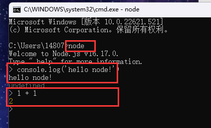

[TOC]


# NodeJs

## 一、介绍

Node.js 是一个基于 Chrome V8引擎的 JavaScript 运行环境，是一个应用程序。

安装Node.js时会自动携带一些内置模块和 npm。

​	npm命令是一个可以下载Node.js模块的命令。

#### 作用：

- 解析运行 JavaScript 代码
- 操作系统资源，如内存、硬盘、网络


>浏览器一般有两个引擎：
>
>1. 模板解析引擎：主要是解析 HTML 和 CSS 模板。
>2. js解析引擎：主要是解析 JavaScript 的引擎。


## 二、初体验

### 交互模式

在window终端(`cmd`命令行)输入`node`，进入 `nodejs` 交互模式



### 执行 `js` 文件

创建文件 hello.js ，并写入代码 console.log('hello world')，命令行运行 `node hello.js`

快速启动命令行的方法

* 在文件夹上方的路径中，直接输入 cmd 即可
* 使用 webstorm 和 vscode 自带的命令行窗口


vscode和webstorm上的命令窗口这里就不在演示

> ​	<span style='color:red'>在 nodejs 环境下，不能使用 BOM 和 DOM ，也没有全局对象 window，全局对象的名字叫 global</span>


## 三、Buffer（缓冲器 模块）

### 1.介绍

Buffer 是一个和数组类似的**对象**，不同的是 Buffer 专门用来保存二进制数据。

Buffer 模块是 `nodejs` 自带的模块。


### 2.特点

- 大小固定：在创建时就确定了，且无法调整
- 性能较好：直接对计算机的内存进行操作（对象中的每一字节都是8位二进制数）
- 每个元素大小为 1 字节（byte）（1 byte = 8 Bit）


### 3.操作

#### 创建 Buffer

- 直接创建 `Buffer.alloc()`
- 通过数组和字符串创建 `Buffer.from()`


#### Buffer 读取和写入

可以直接通过 `[]` 的方式对数据进行处理，可以使用 toString 方法将 Buffer 输出为字符串

* 对 buffer 进行读取和设置

* toString 将 Buffer 转化为字符串


#### 关于溢出

溢出的高位数据会舍弃（相当于十进制减去 256 的倍数）


#### 关于中文

一个 UTF-8 的中文字符大多数情况都是占 3 个字节


#### 单位换算

1Bit 对应的是 1 个二进制位

8 Bit = 1 字节（Byte）

1024Byte = 1KB 

1024KB = 1MB

1024MB = 1GB

1024GB = 1TB

> 平时所说的网速 10M 20M 100M 这里指的是 Bit ，所以理论下载速度 除以 8 才是正常的理解的下载速度


```js
// 1、Buffer 用于创建一个数据类型，保存二进制数
const data = Buffer.alloc(30);
console.log(data); // <Buffer 00 00 00 00 00 00 00 00 00 00 00 00 00 00 00 00 00 00 00 00 00 00 00 00 00 00 00 00 00 00>

// 2、如果是字符串或者数组，可以使用 Buffer.from() 创建
const data1 = Buffer.from('hello');
console.log(data1);  // <Buffer 68 65 6c 6c 6f>
console.log(data1.toString()); // hello 

// Buffer 最终输出的方式是 十六进制，需要转换为十进制才能在对照表（ASCII码表）中找到对应字段

// 3、中文字符 - 在二进制中每个中文字符占比3个字节
const data2 = Buffer.from('中国');
console.log(data2.toString()); // 中国

// 4、高位舍弃
const data3 = Buffer.from('abc');
data3[0] = 365; // 更改第一位，其结果为 365 - 256 = 109， 109 对应的ASCII码表中的 m
console.log(data3.toString());  // mbc
```


## 四、fs 文件相关模块

fs 全称为 `file system`，是 NodeJS 中的内置模块，可以对计算机硬盘中的文件进行增删改查等操作。

### 文件相关方法

```js
// 引入文件
const fs = require('fs');

// 1. 读取文件
fs.readFile(路径, 字符集, 回调函数(err, data)); // 异步
fs.readFileSync(); // 同步

// 2、写入文件
fs.writeFile(路径, 内容, 字符集, 回调函数(err)); // 
fs.writeFileSync(路径, 内容, 字符集); // 

// 3、追加内容
fs.appendFile(路径, 内容, 字符集, 回调函数(err));
fs.appendFileSync(路径, 内容, 字符集);

// 4、创建写入流文件
let ws = fs.createWriteStream(路径);
ws.write(str, 回调函数(err)); // str 代表写入文件流的流数据，且多个ws.write方法里面的不会覆盖前面 ws.write 方法写入的流数据。
...
ws.close(); // 或者 ws.end()

// 5、创建读取流文件
let rs = fs.createReadStream(路径);
rs.on('data', chunk => { ... }); // chunk 代表文件中的流数据

// 6、复制文件: A.pipe(B) 方法： 将文件 A 里面的内容复制给文件 B
// 一般在写入文件流时使用该方法复制文件的内容
rs.pipe(ws);

// 7、更改文件名或者剪贴文件：rename方法
fs.rename(文件原路径, 文件新路径, 回调函数(err)); // 异步
fs.renameSync(文件原路径, 文件新路径); // 同步
            
// 文件夹(没有驼峰)
// 8、创建目录
fs.mkdir(目录名称,{ recursive: true }, 回调函数(err)); // recursive: true 代表可递归创建多个空文件夹
fs.mkdirSync(目录名称,{ recursive: true });

// 9、 读取目录
fs.readdir(路径, 回调函数(err, files));
let files = fs.readdirSync(路径); // 返回一个由文件/文件名组成的数组 

// 10、删除空目录
fs.rmdir(目录名称, 回调函数(err));
fs.rmdirSync(目录名称);
                        
// 11、删除文件
fs.rm(指定路径, 回调函数(err)); 
fs.rmSync(指定路径);
                        
fs.unlink(指定路径, 回调函数(err));    // 异步
fs.unlinkSync(指定路径);     // 同步                        
                        
                        
```


## 五、path 路径相关模块

```js
// 拼接相对路径
path.join(路径1, 路径2, 路径3, ...);

// 拼接绝对路径
path.resolve(路径1, 路径2, 路径3, ...);

// 都会随着执行目录的改变而改变
// 优点：都能拼接，都能根据系统自动切换盘符的分割符
// 缺点：不能准确的给出一个绝对路径

// 解决方法：
// 使用全局属性
	path.join(__dirname, 路径1, ...);
    path.resolve(__dirname, 路径1, ...);
```


## nodejs 全局属性和方法

### 1、属性

```js
// 全局属性：
__dirname,  __filename
```


### 2、方法

```js
// 输出方法：
console.log();

// 定时器：
setTimeOut(() => {
	...
}, timer)

require('模块'); // 方法
```


