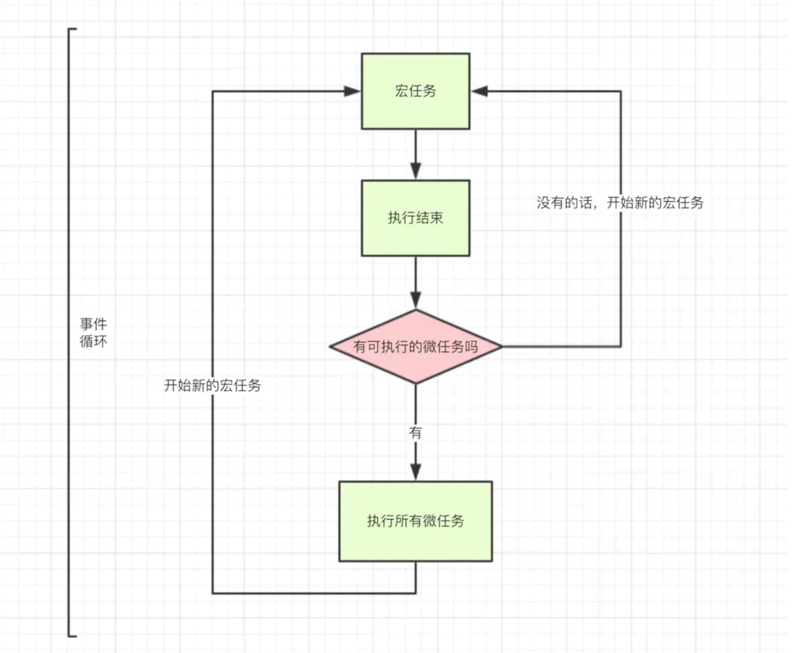
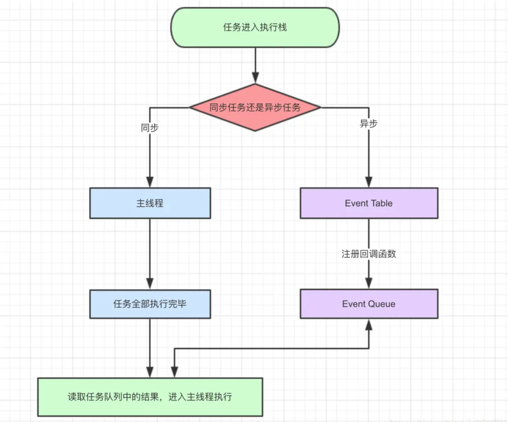

### 1.0 宏任务、微任务和 event-loop


#### 1.1 宏任务 （macrotask）

| #                                                | 浏览器 | Node |
| ------------------------------------------------ | ------ | ---- |
| I / O （ 浏览器中script代码读取写入 ）           | √      | √    |
| setTimeout                                       | √      | √    |
| setInterval                                      | √      | √    |
| setImmediate (长时间任务最后处理的函数)          | ×      | √    |
| requestAnimationFrame （浏览器页面重绘更新动画） | √      | ×    |


#### 1.2 微任务 （microtask）

| #                                                           | 浏览器 | Node |
| ----------------------------------------------------------- | ------ | ---- |
| process.nextTick （定义动作在下一个事件循环的时间点上执行） | ×      | √    |
| MutationObserver （监听 DOM 结构改变）                      | √      | ×    |
| Promise .then catch finally                                 | √      | √    |


> JS 引擎执行页面时，如果有宏任务会把回调函数先放入事件队列
>
> 如果有微任务，会先执行微任务，微任务处理完成则会执行宏任务
>
> 如果微任务比较多，也会有事件队列依次执行，而如果微任务中有宏任务


在当前的微任务没有执行完成时，是不会执行下一个宏任务的

在同步代码执行完成后才回去检查是否有异步任务完成，并执行对应的回调，而微任务又会在宏任务之前执行

所有会进入的异步都是指的事件回调中的那部分代码


### 2.0 event-loop


#### 2.1 事件队列、事件循环

​		js 是单线程的，不可能同时处理很多的事情，所以当任务多了，就有了事件队列 `eventqueue`

​		每完成一个任务都会进行一次队列中的问询，而这样的操作就被称为 `Event Loop`





### 3.0 同步和异步

​	消息队列包括  `异步队列`  和  `事件队列`  ，JS线程空闲下来会优先调用事件队列





#### 3.2 经典面试题


```javascript
setTimeout(function() {
  console.log('1')
})

new Promise(function(resolve, reject) {
  cosole.log('2')
  resolve()
})
.then(function() {
  console.log('3')
})

console.log('4')

// 输出的顺序为: 2, 4, 3, 1

```


```javascript
new Promise((resolve) => {
    console.log('外层宏任务 --- 2')
    resolve()
}).then(() => {
    console.log('微任务1')
}).then(()=>{
    console.log('微任务2')
})

console.log('外层宏任务 --- 1')

setTimeout(() => {
    console.log('内层宏任务3')
}, 0)

// 输出的结果为:

```


```html
<script>
      function func(num) {
        return function() {
          console.log(num)
        }
      }
      setTimeout(func(1))
      async function async3() {
        await async4()
        console.log(8)
      }
      async function async4() {
        console.log(5)
      }
      async3()
      function func2() {
        console.log(2)
        async function async1() {
          await async2()
          console.log(9)
        }
        async function async2() {
          console.log(5)
        }
        async1()
        setTimeout(func(4))
      }
      setTimeout(func2)
      setTimeout(func(3))
      new Promise(resolve => {
        console.log("Promise")
        resolve()
      })
        .then(() => console.log(6))
        .then(() => console.log(6))
      console.log(0)
    </script>
```

